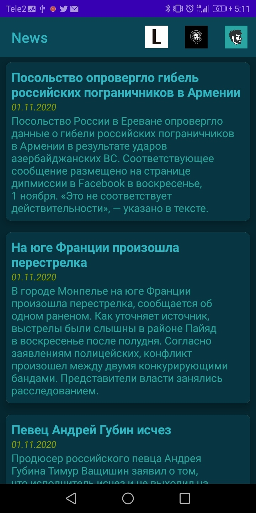

# RSSAgregator
[](https://travis-ci.com/PawMaw/RSSAgregator.svg?branch=master)

Павел Матвеев
Задание по Java SE, вариант 1
### Описание

Агрегатор новостей из RSS новостных лент.
Использемые ресурсы:
- [Lenta] - Российское новостное интернет-издание.
- [Meduza] - Онлайн-газета и агрегатор новостей на русском языке в Риге.
- [Tproger] - Онлайн ресурс для IT-специалистов.

[Lenta]: <https://lenta.ru/>
[Meduza]: <https://meduza.io/>
[Tproger]: <https://tproger.ru/>

### Установка
Для установки проекта требуется просто открыть его в Android Studio.
Для тестирования потребуется устройство с операционной системой Android ```>=8.0.0```

### Скриншоты приложения


